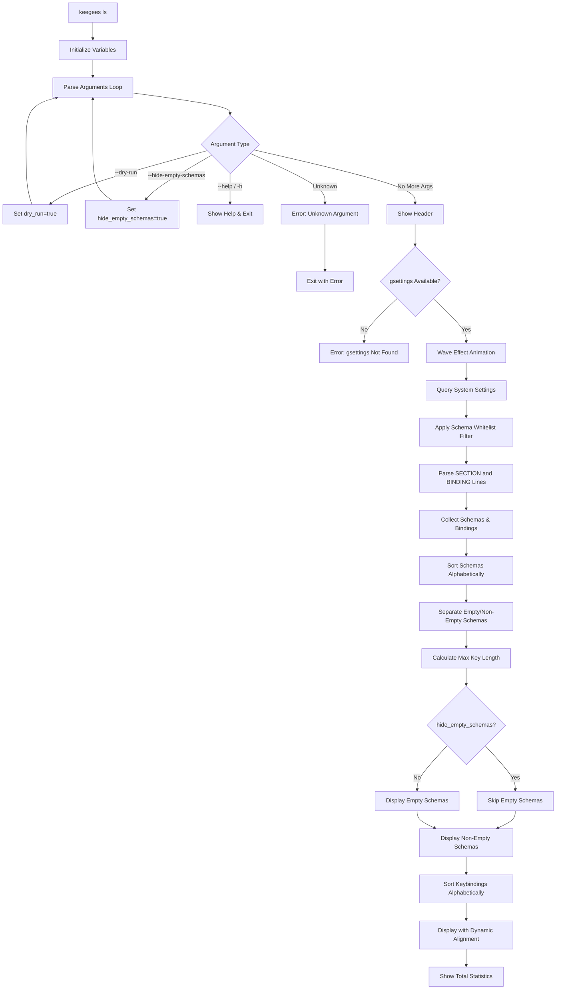
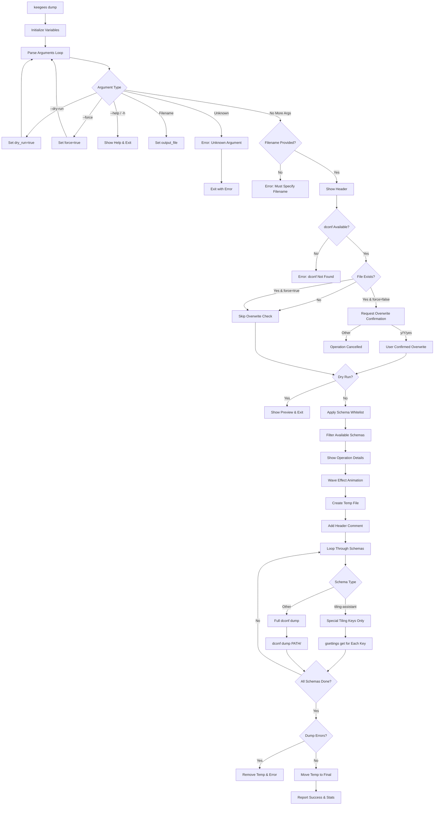
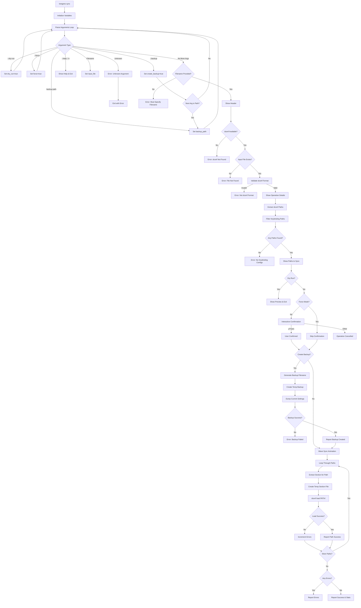
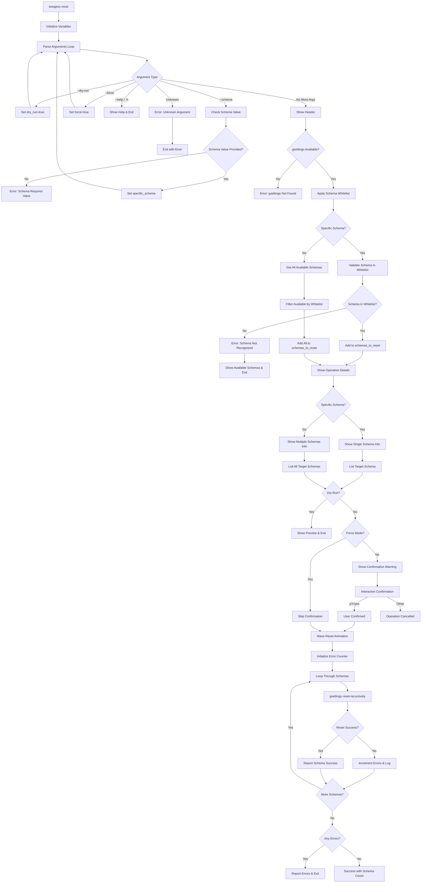
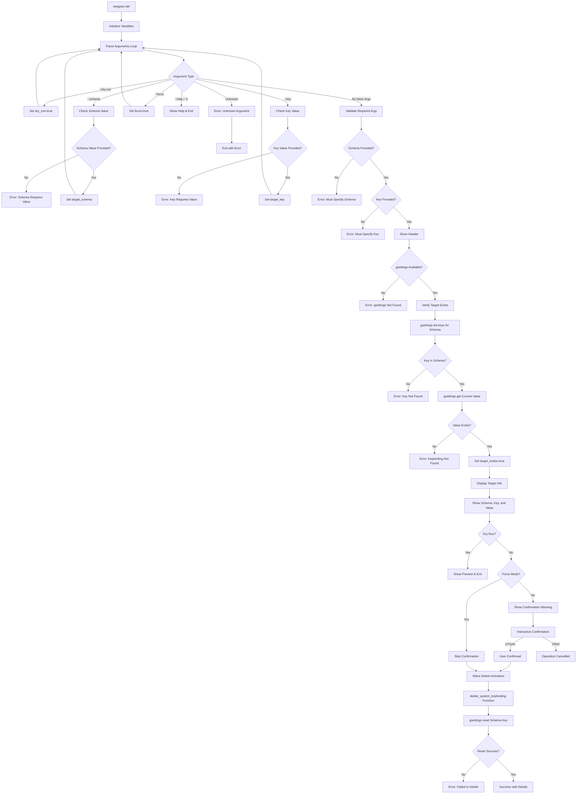
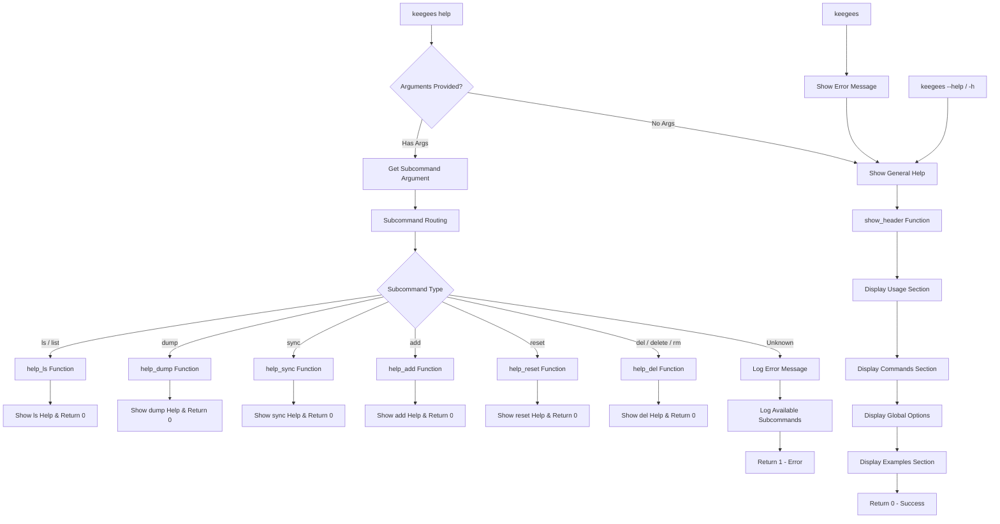

# ⌨️ keegees

[](https://www.gnu.org/software/bash/)
[](https://www.linux.org/)
[](https://www.gnome.org/)
[](LICENSE)
[](https://github.com/nutthead/keegees)


> **Query and manage GNOME keybindings from the CLI with style**

keegees is a comprehensive command-line tool for managing GNOME desktop keybindings with
_"style"_.

Featuring schema-based organization, safety mechanisms, and a beautiful terminal interface with
subtle animations and 24-bit color support.

## 📽️ Introduction


## ⚠️ WARNING

Always use `--dry-run` before making destructive/mutating changes to your system keybindings, as
keegees is in version 0.0.1 and may contain bugs.

## ✨ Overview

keegees provides a unified interface for GNOME keybinding management from the CLI.

We have made keegees use features available in modern terminals to provide a visually appealing
experience.

### 🎯 Key Features

- **Schema-Based Architecture** - Uses official GNOME keybinding schemas for reliable detection of
  keybinding entries in gsettings/dconf. However, we only support management of official Gnome keybinding
  schemas and System Extensions.
- **Query System Settings** - Use the `ls` subcommand to list all current active keybindings
- **Complete Reset Functionality** - Implements the "Reset All..." settings from GNOME Settings,
  using gsettings reset-recursively
- **Safety First** - Dry-run mode, interactive confirmations, and comprehensive validation
- **Beautiful Interface** - 24-bit color support, animations, and Unicode icons
- **POSIX Compliant** - Uses `bc` (basic calculator) for arithmetic and avoids bash's surprising, unexpected
  behaviors, such as early termination due to result arithmetic---`(( ... ))`---expressions, and other bashisms.
- **Professional CLI** - Comprehensive help system and intuitive command structure
- **Schema Organization** - Hierarchical display with empty schema filtering
- **Error Resilience** - Graceful handling of missing schemas and invalid configurations

## 🚀 Installation

```bash
# Clone and install
git clone https://github.com/nutthead/keegees.git
cd scripts/sh/keegees
./install.sh

# Or install as symlink for development
./install.sh --symlink

# Verify installation
keegees --help
```

### Dependencies

- **bash** - Script execution
- **gsettings** - System keybinding queries (install with `glib2-devel`)
- **bc** - POSIX-compliant arithmetic

## 💻 CLI Usage

```
🔮                                                                            🔮
╭──────────────────────────────────────────────────────────────────────────────╮
│                                    KEEGEES                                   │
│                        GNOME keybinding management system                    │
│                                  Version 1.0.0                               │
╰──────────────────────────────────────────────────────────────────────────────╯


📖 Usage
  keybind <command> [options]

🚀 Commands
  ls     [--hide-empty-schemas] [--dry-run]        List keybindings
  dump   <filename> [--force] [--dry-run]          Export keybindings to dconf format
  sync   <filename> [--backup] [--dry-run]         Import keybindings from dconf format
  add    [--dry-run]                               Interactively add new keybinding
  reset  [--schema] [--force] [--dry-run]          Reset keybindings to defaults
  del    --schema <schema> --key <key> [options]   Delete existing keybinding
  help   [command]                                 Show help message

⚙️ Global Options
  --verbose             Show additional information
  --dry-run             Show what would be done without making changes
  --help|-h             Show help message

🌟 Examples
  keybind ls --hide-empty-schemas             List system keybindings, hide empty schemas
  keybind dump backup.dconf                   Export keybindings to file
  keybind sync backup.dconf --backup          Import keybindings with backup
  keybind reset                               Reset all system keybindings
  keybind del --schema org.gnome.shell.keybindings --key screenshot
```

## 📋 Commands

### `ls` - List Keybindings

Display keybindings from live system settings.

<details>
<summary>Flowchart</summary>



</details>

**Key Features:**

- **Schema Whitelist** - Only shows official GNOME keybinding schemas (no false positives)
- **System integration** - Direct access to live gsettings with reliable detection
- **Schema-based organization** - Visual hierarchy with Unicode icons
- **Empty schema filtering** - Optional `--hide-empty-schemas` flag
- **Beautiful color-coded output** - 24-bit color support with dynamic alignment
- **GNOME-compliant** - Uses official keybinding schema organization

**Official Schemas:**

- `org.gnome.desktop.wm.keybindings` (Window manager)
- `org.gnome.shell.keybindings` (Shell-specific)
- `org.gnome.mutter.keybindings` (Compositor)
- `org.gnome.mutter.wayland.keybindings` (Wayland session)
- `org.gnome.settings-daemon.plugins.media-keys` (Media keys)
- `org.gnome.shell.extensions.tiling-assistant` (Ubuntu Tiling Assistant extension)

### `dump` - Export Keybindings

Export current GNOME keybinding configurations to a dconf format file for backup, sharing, or version control.

<details>
<summary>Flowchart</summary>



</details>

**Key Features:**

- **Native dconf format** - Perfect roundtrip compatibility with `keegees sync`
- **Schema whitelist filtering** - Only exports official GNOME keybinding schemas
- **Force overwrite** - `--force` flag to overwrite existing files
- **Dry run support** - Preview operations with `--dry-run`
- **Comprehensive output** - Beautiful formatted export with schema organization
- **Extension support** - Includes Ubuntu Tiling Assistant and other popular extensions

**Export Format:**

- **Format**: dconf key-file format (native GNOME)
- **Schemas**: Official GNOME keybinding schemas only
- **Compatibility**: Perfect roundtrip with `keegees sync`
- **Portability**: GNOME-specific (not cross-platform)

### `sync` - Import Keybindings

Import keybindings from a dconf format file, applying them to the live GNOME system settings.

<details>
<summary>Flowchart</summary>



</details>

**Key Features:**

- **dconf format support** - Imports files created by `keegees dump`
- **Automatic backup** - Optional backup of current settings before import
- **Interactive confirmation** - User approval before applying changes
- **Dry run mode** - Preview import operations safely
- **Path validation** - Ensures only keybinding paths are imported
- **Atomic operations** - Uses dconf load for reliable imports

### `reset` - Reset Keybindings

Reset GNOME keybindings to their default values. Implements the same functionality as GNOME Settings "Reset All..." button.

<details>
<summary>Flowchart</summary>



</details>

**Key Features:**

- **GNOME Settings Compatible** - Uses `gsettings reset-recursively` like official GNOME Settings
- **System Integration** - Works directly with live gsettings to reset keybindings
- **Selective Reset** - `--schema` option to reset specific keybinding schemas only
- **Safety Mechanisms** - Interactive confirmation, `--force` override, `--dry-run` preview
- **Schema Validation** - Only allows official GNOME keybinding schemas
- **Professional Output** - Beautiful animations and progress reporting

### `del` - Delete Keybindings

Safely delete individual keybindings with comprehensive validation and backup options.

<details>
<summary>Flowchart</summary>



</details>

**Safety Features:**

- **Target validation** - Verifies keybinding exists before deletion
- **Interactive confirmation** - User prompts with `--force` override
- **Dry-run mode** - Safe previewing with `--dry-run`
- **System integration** - Direct gsettings operations for reliable deletion
- **Comprehensive error handling** - Graceful failure scenarios

### `add` - Add Keybindings

Interactively add new keybindings with comprehensive validation, conflict detection, and beautiful step-by-step guidance.

```mermaid
flowchart TD
    A[keegees add] --> B[Initialize Variables]
    B --> C[Parse Arguments Loop]
    C --> D{Argument Type}
    D -->|--dry-run| E[Set dry_run=true]
    D -->|--help / -h| F[Show Help & Exit]
    D -->|Unknown| G[Error: Unknown Option]
    D -->|No More Args| H[Show Header]

    E --> C
    G --> I[Show Help & Exit]

    H --> J[Apply Schema Whitelist]
    J --> K[Query gsettings list-schemas]
    K --> L{Schemas Available?}
    L -->|No| M[Error: No Schemas Available]
    L -->|Yes| N[Filter to Whitelisted Schemas]

    N --> O{Any Whitelisted Schemas?}
    O -->|No| P[Error: No Whitelisted Schemas]
    O -->|Yes| Q[Step 1: Schema Selection]

    Q --> R[Display Numbered Schema List]
    R --> S[Read User Choice]
    S --> T{Valid Number?}
    T -->|No| U[Error: Invalid Selection]
    T -->|Yes| V[Set selected_schema]

    V --> W[Step 2: Key Name Input]
    W --> X[Read Key Name]
    X --> Y{Key Name Empty?}
    Y -->|Yes| Z[Error: Empty Key Name]
    Y -->|No| AA[Check if Key Exists]

    AA --> BB{Key Exists & Has Value?}
    BB -->|Yes| CC[Show Existing Value Warning]
    BB -->|No| DD[Step 3: Key Combination]

    CC --> EE[Overwrite Confirmation]
    EE -->|y/Y/yes| FF[User Confirmed Overwrite]
    EE -->|Other| GG[Operation Cancelled]

    FF --> DD
    DD --> HH[Show Key Combination Examples]
    HH --> II[Read Key Combination]
    II --> JJ{Combination Empty?}
    JJ -->|Yes| KK[Error: Empty Combination]
    JJ -->|No| LL[Validate Format with Regex]

    LL --> MM{Format Valid?}
    MM -->|No| NN[Show Format Warning]
    MM -->|Yes| OO[Step 4: Conflict Detection]

    NN --> PP[Format Confirmation]
    PP -->|y/Y/yes| QQ[User Accepts Format]
    PP -->|Other| RR[Operation Cancelled]

    QQ --> OO
    OO --> SS[Initialize Conflict Variables]
    SS --> TT[Loop Through All Schemas]

    TT --> UU[gsettings list-keys for Schema]
    UU --> VV[Loop Through Schema Keys]
    VV --> WW[gsettings get Value]
    WW --> XX{Value Matches Combination?}

    XX -->|Yes & Different Key| YY[Add to Conflicts]
    XX -->|No| ZZ{More Keys in Schema?}
    YY --> ZZ

    ZZ -->|Yes| VV
    ZZ -->|No| AAA{More Schemas?}
    AAA -->|Yes| TT
    AAA -->|No| BBB{Conflicts Found?}

    BBB -->|Yes| CCC[Display Conflicts List]
    BBB -->|No| DDD[Report No Conflicts]

    CCC --> EEE[Conflict Confirmation]
    EEE -->|y/Y/yes| FFF[User Accepts Conflicts]
    EEE -->|Other| GGG[Operation Cancelled]

    DDD --> HHH[Step 5: Preview Summary]
    FFF --> HHH
    HHH --> III[Show Complete Summary]
    III --> JJJ{Dry Run?}

    JJJ -->|Yes| KKK[Show gsettings Command & Exit]
    JJJ -->|No| LLL[Final Confirmation]

    LLL -->|y/Y/yes| MMM[User Final Confirm]
    LLL -->|Other| NNN[Operation Cancelled]

    MMM --> OOO[Step 6: Execute Addition]
    OOO --> PPP[gsettings set Command]
    PPP --> QQQ{gsettings Success?}

    QQQ -->|No| RRR[Error: Failed to Set]
    QQQ -->|Yes| SSS[Verification gsettings get]

    SSS --> TTT{Verification Success?}
    TTT -->|No| UUU[Warning: Verification Failed]
    TTT -->|Yes| VVV[Success with Details]
```

<details>
<summary>Flowchart</summary>



</details>

**Key Features:**

- **6-Step Interactive Workflow** - Schema selection → Key name → Combination → Conflicts → Preview → Execution
- **Comprehensive Validation** - Schema existence, key naming, combination format, and conflict detection
- **Cross-Schema Conflict Detection** - Scans all available schemas to detect existing key combinations
- **Multiple Safety Confirmations** - Key overwrite, format warnings, conflict acknowledgment, and final confirmation
- **Dry-Run Support** - Preview mode shows exact gsettings command without execution
- **Beautiful Step-by-Step UI** - Color-coded workflow with clear progress indicators and examples
- **Error Resilience** - Graceful handling of invalid inputs with helpful error messages

**Interactive Process:**

1. **Schema Selection**: Choose from available GNOME keybinding schemas with numbered menu
2. **Key Naming**: Enter unique key name with existing key detection and overwrite options
3. **Combination Input**: Define key combination with format examples and validation
4. **Conflict Detection**: Automatic scanning across all schemas with user-friendly conflict reporting
5. **Preview Summary**: Complete overview of what will be added with all details
6. **Execution**: gsettings integration with verification and success confirmation

### `help` - Show Help Information

Display comprehensive help information for keegees commands with intelligent routing to specific subcommand documentation.

<details>
<summary>Flowchart</summary>



</details>

**Key Features:**

- **Multiple Entry Points** - Direct command, global flags (`--help`, `-h`), and error fallback routing
- **Intelligent Dispatch** - Routes specific subcommand help requests to dedicated help functions
- **Comprehensive Coverage** - General help displays usage, all commands, options, and examples
- **Alias Support** - Handles command aliases (list→ls, delete→del, rm→del)
- **Error Handling** - Unknown subcommands show helpful error messages with available options
- **Consistent Formatting** - Beautiful color-coded output matching the application's visual theme

**Help Routing Logic:**

- **General Help**: Shows complete command overview when invoked without arguments
- **Specific Help**: Routes `help <subcommand>` to dedicated help functions (help_ls, help_dump, etc.)
- **Global Flags**: `--help` and `-h` flags trigger general help from any context
- **Error Recovery**: Unknown commands automatically display help for user guidance

**Help Content Structure:**

1. **Usage**: Command syntax and argument patterns
2. **Commands**: Complete list of available subcommands with descriptions
3. **Options**: Global flags and their functionality  
4. **Examples**: Common usage patterns and real-world scenarios

## 🎨 Examples

### Basic Usage

```bash
# List all keybindings from system
keegees ls

# List system keybindings, hiding empty schemas
keegees ls --hide-empty-schemas

# Export current keybindings to file
keegees dump my-keybindings.dconf

# Import keybindings from file with backup
keegees sync my-keybindings.dconf --backup --dry-run
```

### Reset Operations

```bash
# Reset all system keybindings (like GNOME Settings "Reset All...")
keegees reset

# Reset only window manager keybindings
keegees reset --schema org.gnome.desktop.wm.keybindings

# Preview reset changes safely
keegees reset --dry-run

# Reset without confirmation prompts
keegees reset --force
```

### Advanced Operations

```bash
# Add a new keybinding interactively
keegees add

# Preview add operation without making changes
keegees add --dry-run

# Delete a specific keybinding
keegees del --schema org.gnome.desktop.wm.keybindings --key close

# Force delete without confirmation
keegees del --schema org.gnome.shell.keybindings --key screenshot --force

# Preview deletion before executing
keegees del --schema org.gnome.desktop.wm.keybindings --key minimize --dry-run
```

### Professional Workflows

```bash
# Complete backup and restore workflow
keegees dump "backup-$(date +%Y%m%d_%H%M%S).dconf"
# ... make changes ...
keegees sync "backup-$(date +%Y%m%d_%H%M%S).dconf" --backup

# Selective schema operations
keegees reset --schema org.gnome.desktop.wm.keybindings --dry-run
keegees reset --schema org.gnome.shell.keybindings --force

# Documentation and auditing
keegees ls --hide-empty-schemas > current-keybindings.txt
keegees dump current-state.dconf
```

## 🛠️ Development

### 🧬 Project Structure

```
keegees/
├── keegees.sh        # Main executable script (1889 lines)
├── install.sh        # POSIX-compliant installation script
├── .shellcheckrc     # ShellCheck configuration for code quality
├── README.md         # This file
└── CLAUDE.md         # Development guidance
```

### 🗿 Architecture

**Schema-Based Design**: Uses official GNOME keybinding schema whitelist for reliable keybinding detection and
eliminating false positives from configuration arrays.

**System Integration**: Works directly with dconf format files and live gsettings queries with consistent parsing and validation.

**Safety-First Approach**: Implements comprehensive validation, interactive confirmations, dry-run modes, and dconf
backup functionality.

**Visual Excellence**: Uses modern terminal capabilities for a beautiful user experience, and gracefully falls back to
a simpler UX on terminals without advanced features.

Features 24-bit color detection, Unicode animations, terminal capability detection, and beautiful
formatted output.

### 🫂 Contributing

1. Fork the repository
2. Create a feature branch (`git checkout -b feature/amazing-feature`)
3. Test your changes thoroughly
4. Commit with conventional commit format (`git commit -m 'feat: add amazing feature'`)
5. Push to the branch (`git push origin feature/amazing-feature`)
6. Open a Pull Request

### 📝 Code Style

- Follow POSIX shell standards where possible
- Use `bc` for arithmetic (never bash-specific `$((...))`)
- Maintain consistent indentation (4 spaces)
- Add comprehensive error handling
- Include help documentation for all commands
- Follow schema-based architecture patterns

## 📄 License

This project is licensed under the MIT License - see the [LICENSE](LICENSE) file for details.

## 🙏 Acknowledgments

- **GNOME Project** - For the excellent desktop environment and gsettings system
- **bs.scripts** - Part of the broader bs.scripts utility collection
- **Shell Community** - For POSIX compliance guidance and best practices

---

<div align="center">

**[⭐ Star this project](https://github.com/nutthead/keegees)** •
**[🐛 Report Issues](https://github.com/nutthead/keegees/issues)** •
**[💡 Request Features](https://github.com/nutthead/keegees/discussions)**

<!-- markdownlint-disable-next-line MD036 -->
**Built with ❤️ and 🤖 for the GNOME community**

</div>
